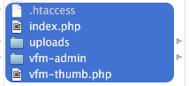
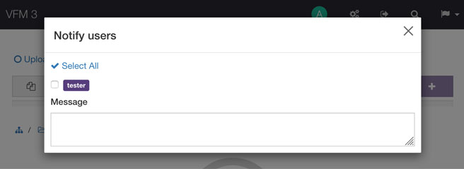
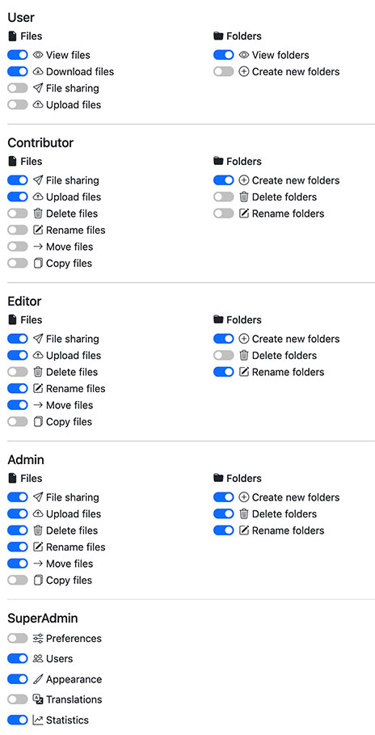

Thank you for purchasing **Veno File Manager**.  
If you have any questions that are beyond the scope of this help file, 
visit the [Support forum.](http://veno.es/support/categories/veno-file-manager)  
or feel free to email via the [support contact form](https://codecanyon.net/item/veno-file-manager-host-and-share-files/6114247/support/contact).  

Thanks so much!

# Installation

Copy all files contained inside the “VFM” folder to your 
web space via FTP (put everything in the root if you will use the whole 
domain as file manager, otherwise create a custom directory and upload 
everything in it).



Navigate with your browser to the url where you uploaded the files and log in as:

- **username:** admin
- **password:** password

Inside the administration area, go under USERS and update your **Master Admin** credentials (password and username).

That’s all! go back to the VFM front-end and start building your archive with basic settings.

## Uploads Directory

By default VFM keeps uploaded files inside the directory called **uploads**, and creates sub directories in it.

If you want to rename the main **Uploads Directory**,
 do it from the Administration panel, this way the system will rename 
the folder and will update configuration settings as well.

You can use VFM also with preexistent archives uploading

- `.htaccess`

- `index.php`  

- `vfm-thumb.php`  

- `/vfm-admin/`

at the same level of your main uploads directory and updating the **Uploads Directory** field under general settings

# Migration

If you are moving the script already installed and 
configured in a new location (from local to server, from server to 
local, or in a different directory) remember to update the value **URL of your app** under Preferences > general settings.

This should be always the full URL of your application, with a final slash / ( e.g. http://www.example.com/ )

# Options

To best fit your needs you have an **administration** panel where you can choose many options

## Allowed extensions

From general settings you can choose if to exclude some 
file extensions, or if you prefer, to only allow some extensions (and 
exclude all the others).

## Pretty links

If you activate Pretty links, the script will convert download urls from `/vfm-admin/vfm-downloader.php?q=xxx` to `/download/xxx`.

This option needs the `.htaccess` provided inside the main directory of the script, and the Apache Module **mod_rewrite** on your server.

#### For NGINX Servers try the following configuration:

**Script running in sub directory (e.g: www.example.com/RELATIVE_PATH )**

```
# nginx VFM configuration

location /RELATIVE_PATH {
    index index.php;
    rewrite /download/(.*)/h/(.*)/sh/(.*) /RELATIVE_PATH/vfm-admin/vfm-downloader.php?q=$1&sh=$2 last;
    rewrite /download/(.*)/h/(.*) /RELATIVE_PATH/vfm-admin/vfm-downloader.php?q=$1&h=$2 last;
    rewrite /download/zip/(.*)/n/(.*) /RELATIVE_PATH/vfm-admin/vfm-downloader.php?zip=$1&n=$2 last;
}
```

#### For IIS Servers try to convert the following rules:

[Importing Apache mod_rewrite Rules in IIS 7 and above](https://www.iis.net/learn/extensions/url-rewrite-module/importing-apache-modrewrite-rules)

**Script running in web root (e.g: www.example.com/ )**

if the script is not inside the web root, change the `RewriteBase` path

```
# begin VFM rules
<IfModule mod_rewrite.c>
RewriteEngine on
RewriteBase /
RewriteCond %{REQUEST_FILENAME} !-f
RewriteCond %{REQUEST_FILENAME} !-d
RewriteRule download/(.*)/h/(.*)/sh/(.*) vfm-admin/vfm-downloader.php?q=$1&sh=$2 [L]
RewriteRule download/(.*)/h/(.*) vfm-admin/vfm-downloader.php?q=$1&h=$2 [L]
RewriteRule download/zip/(.*)/n/(.*) vfm-admin/vfm-downloader.php?zip=$1&n=$2 [L]
</IfModule>
# end VFM rules
```

## Thumbnails

The script uses GD Library to create thumbnails. If the 
process fails (very big images and low server memory) a placeholder will be used as thumbnail.

You can edit the default **placeholder.jpg** inside `/vfm-admin/images/`

~~You could also try to open the file `vfm-thumb.php` and increase your server's memory limit removing the comment on line 20 and adjusting the value: `ini_set('memory_limit', '512M');`~~

**UPDATE:** Since version 2.6.1 the script automatically tries to set an higher `memory_limit` if needed, so if you see the placeholder, the server is actually not able to increase its memory to that value.

## .zip multiple files

~~In order to prevent timeouts and server errors during the zip process, the script is limited to .zip files up to 1 GB, and 2000 items max together;~~

~~if the values are exceeded, it asks you to download less files.~~

~~You can adjust these values if your server is more or less performant, changing `Max Files` and `Max File Size` under general settings~~

UPDATE: Since version 4.0 the .zip archives are directly streamed to the user's browser, which is faster and can handle bigger archives.

## Upload notifications

If the option **Send upload notifications to other users** is active, any user with an e-mail address associated will be able to 
select the other users who can access to the current directory and send 
them automatic upload notifications




## Remote upload

If the option **Remote upload** (under permissions) is active, you will be able to upload files directly from remote urls.


NOTE: the remote uploader is subject to the server upload 
limits, so if you want to upload big files you should possibly increase 
the following values via htaccess:

    php_value upload_max_filesize 100M
    php_value post_max_size 128M

Adjust to your needs and set `post_max_size` always higher than `upload_max_filesize`

## Security

You can strengthen the security enabling a standard CAPTCHA or a Google ReCAPTHCA for the following actions: 

**Login**, **Reset Password**, **File Sharing**, **Registration**.

You can optionally whitelist or blacklis some IPs.
If you use the whitelist be sure to include your IP, if you use the blacklist be sure to exclude your IP.

If you are locked and can't access the script because your IP is accidentally blacklisted you can manually update the values `'ip_blacklist'` or `'ip_whitelist'` inside the file `/vfm-admin/config.php`.

# E-mail settings

**File sharing**, **New user notification** and **Password Recovering** use [PHPmailer](https://github.com/PHPMailer/PHPMailer), with the possibility to choose between the **php mail()** funcion (default), or **SMTP mail**.

Using the same server of your installation as primary email is strongly recommended, to avoid being flagged as spam.  
(e.g: if the script is running on www.example.com, the mail 
sender should be something like noreply@example.com, or 
info@example.com)

**NOTE**: If you haven't set SMTP mail and 
the script says "message sent", but you don't receive any e-mail, 
probabily your server refuses to send `mail()` in HTML format, so setting up a SMTP account should solve the problem.

SMTP connection errors can be tracked setting **DEBUG SMTP** ON

## E-mail templates

you can customize your e-mail templates editing the following files:

- `vfm-admin/_content/mail-template/template-activate-account.html` (New account activation)
- `vfm-admin/_content/mail-template/template-new-user.html` (send a notification to new user)
- `vfm-admin/_content/mail-template/template-reset-password.html` (password recovering)
- `vfm-admin/_content/mail-template/template-send-files.html` (file sharing)
- `vfm-admin/_content/mail-template/template-uploaded-files.html` (Upload notification to other users)

**Variables**

```html

```

A custom header image can be uploaded from Preferences > E-Mail

```
%translate_value%
```

translatable values editable from the language manager (**translate_** followed by the translation key)

**Required**

```
%any_other_value%
```

Dynamic variables like share link, app name, password recovery link

# File sharing

By default the system provides download links to copy-paste where you prefer

To enable E-mail file sharing you must compile the **send system e-mails from** field

## Password protection

If password protection is enabled, any user will be able to choose a password or get a random password to protect sharing links

## Expiration date for download links

At the top of `vfm-admin/index.php` you will find the array who controls the dropdown menu with default values

```php
$share_lifetime = array(
    // "days" => "menu value"
    "1" => "24 h",
    "2" => "48 h",
    "3" => "72 h",
    "5" => "5 days",
    "7" => "7 days",
    "10" => "10 days",
    "30" => "30 days",
    "365" => "1 year",
    "36500" => "Unlimited (100 years)",
    );
```

Update the values and select the new date in the administration page

# Users

## Manage users

Inside users panel you are able to:

- List avialble users
- Update password, username, role, e-mail, assign dedicated folder(s) for all pre-existing Users, and set a maximum available space
- Add New Users

When adding or editing a user, if you type in "New Directory" field, a new folder inside the main uploads directory will be created for you, and added to the user's directories list (you can also assign pre-existing folders)

## Roles and permissions

***Master Admin*** is the first User in configuration settings, and is the only who can't be deleted.

All the other users may have one of 5 available roles, any role can have more or less permissions:




#### User

***Optional permissions:***

- View files
- Download files
- File sharing
- Upload files

- View folders
- Create new folders

#### Contributor

***Minimum permissions:***

- View files
- Download files

- View folders

***Optional permissions:***

- File sharing
- Upload files
- Delete files
- Rename files
- Move files
- Copy files

- Create new folders
- Delete folders
- Rename folders

#### Editor

***Minimum permissions:***

- View files
- Download files

- View folders

***Optional permissions:***

- File sharing
- Upload files
- Delete files
- Rename files
- Move files
- Copy files

- Create new folders
- Delete folders
- Rename folders

#### Admin

***Minimum permissions:***

- View files
- Download files

- View folders

***Optional permissions:***

- File sharing
- Upload files
- Delete files
- Rename files
- Move files
- Copy files

- Create new folders
- Delete folders
- Rename folders

#### SuperAdmin

***Minimum permissions:***

- View files
- Download files
- File sharing
- Upload files
- Delete files
- Rename files
- Move files
- Copy files

- View folders
- Create new folders
- Delete folders
- Rename folders

***Optional permissions (Admin panel):***

- Preferences
- Users
- Appearance
- Translations
- Statistics 

## Max user quota (available space)

Available space will only affect users with dedicated folders and with the ability to upload files. If you set more than one directory per user, the limit will consider the sum of the assigned directories

**NOTE:** Available space considers the space used inside of the assigned folder(s), so if you assign the same folder to more than one user, they will share the same space. (if you assign 100Mb to User01 inside folder01 and 100Mb to User02 inside the same folder, if User01 uploads 100Mb, User02 will have no more space, and viceversa)

You can change the default values (in MB) inside of 
`vfm-admin/index.php`

```php
$_QUOTA = array(
    "10",
    "20",
    "50",
    "100",
    "200",
    "500",
    "1024", // 1GB
    "2048", // 2GB
    "5120", // 5GB
);
```

## Avatars (profile picture)

Profile pictures can be updated by users from their frontend profile editor

## Custom Fields

Since version 2.7 you can add some custom fields to every user (e.g: address, telephone...)

Edit te file `/vfm-admin/_content/users/**customfields-example.php**`, there are 3 examples: a simple text input, a select input and a textarea.  
Set `'list' => true,` to list the field inside the users table.  
After your edits rename the file in **customfields.php** (remove -example).

The new additional fields will appear on every user's form: registration, administration panel, user's panel.

# Appearance

The panel **Appearance** includes color pickers, a customizer and the options for the notification alerts

## Customizer

- Custom logo for the Navigation Bar

- Custom header image

- Header layout (Boxed / Wide)

- Header image margins and alignment

- Optional rich text description

## Colors

Choose your main color palette: 

- Primary color: Buttons and links

- Dark color: Navbar and header

- Light color: Main content

The script will automatically create all the color variations based on the selected palette

- Custom color for the progress bar

## Templates

To create your custom HTML template: copy the php files you wish to edit

from the folder `/vfm-admin/template/`
to folder `/vfm-admin/_content/template/`

Additional files may be included inside the main index.php with the following php code:

```php
include dirname(__FILE__).'/vfm-admin'.$template->include('filename');
```

(replace `filename` with the name of the template part you want to include, without .php)
If the script does not find the file inside the `/vfm-admin/_content/template/` folder it will take the default one inside of `/vfm-admin/template/`

## Custom CSS

If you want to add some custom css you can do it writing inside the file `/vfm-admin/_content/template/style.css`

## Audio notifications

You can add your custom **Audio notification after upload** simply placing a new .mp3 file  
inside the folder `/vfm-admin/_content/audio/`, it will be a new voice under the dropdown menu (Appearance > Notifications)

# Translations

VFM is expandable to every language! simply go to 
Administration > Transltions, add new language and compile it or edit one of the 
pre-existing.

You may choose to set your default language and hide 
language menu from the front-end, or create your custom language 
collection by adding some new and removing unwanted (English language 
is the only required)

Untranslated terms will appear in your front end in this way: **>translate_key<**

# Statistics

Since version 1.2 there's the possibility to activate a statistics system who stores daily archives of main activities:

- Files download
- Files upload
- Audio play
- Files and folders deletion
- Folders creation

If you want to backup your statistics just download the .json files from the `vfm-admin/_content/log/` directory, or select a date range and download the statistics in .CSV format

# Privacy policy

To activate the "terms and conditions" checkbox inside the Registration form rename the file `/vfm-admin/_content/_registration-disclaimer.html` in `registration-disclaimer.html` (remove the underscore) and edit its contents.

To activate the "terms and conditions" checkbox inside the Login form rename the file `/vfm-admin/_content/_login-disclaimer.html` in `login-disclaimer.html` (remove the underscore) and edit its contents.

To activate the "Privacy policy" link inside the footer, rename the file `/vfm-admin/_content/_privacy-info.html` in `privacy-info.html` (remove the underscore) and edit ist contents.

# Password recovering

A password recovery system via e-mail is available 
starting from version 1.3; if your account has a valid e-mail 
associated, you can just click on "Lost your password?" under login 
mask, and follow the instructions provided.

## Master Admin password recovering

if you lose your MasterAdmin password (and you haven't an e-mail address associated), open `/vfm-admin/users/users.php` file, and remove the encrypted password on **line 7**

( change it in: `'pass' => '',` )

```php
$_USERS = array (
   0 =>
   array (
      'name' => 'admin',
      'pass' => '',
      'role' => 'superadmin',
      ...
```

After this operation you will be able to log in again as Master Admin with default password: **password**

# Hotlinking

## Apache server

in order to pevent hotlinking (direct access to your 
files), the uploads directory must be a subdirectory of the main VFM, 
and must have the `.htaccess` file provided inside of it.

That option is automatic on Apache servers. If you are on
 NGINX or IIS server you should block the direct access to static files 
inside your main uploads directory editing the server configuration.

## NGINX server

Since Nginx does not have an equivalent to the .htaccess file (i.e. 
no directory level configuration files), you need to update the main 
configuration and reload nginx for any changes to take effect.

```
location ~ /uploads/*.* {
    deny all;
    return 403;
}
```

This example assumes that the script has been installed inside the 
root directory and the main uploads directory is /uploads/, otherwise 
adjust the relative path.

## IIS server

Create a file `web.config` with the following content, and place it inside your main /uploads/ directory

```
<?xml version="1.0" encoding="UTF-8"?>
<configuration>
  <system.webServer>
    <security>
      <requestFiltering>
        <!-- prevent url access to this and sub directories -->
        <denyUrlSequences>
          <add sequence="/" />
        </denyUrlSequences>
      </requestFiltering>
    </security>
  </system.webServer>
</configuration>
```

NOTE: Hotlinking can't be prevented with **Direct Links** ON.  
NGINX and IIS configurations shouldn't be set if you want to use the Direct links.

# Notes

## Errors

If you can't do the first login, probabily the script hasn't enough permissions to write on **config.php** and **/_content/users/**, consult this [F.A.Q.](http://codecanyon.net/item/veno-file-manager-host-and-share-files/6114247/faqs/19875)

For any other issue, as first check, turn ON all php notices:  

At the bottom of the main administration page you will find the option 

- [x] **DEBUG MODE**

This option will display all PHP errors and notices (if any).

## BIG file size

### Uploads

From version 1.5 VFM has a chunk uploading system integrated, based on [resumable.js](http://resumablejs.com/)

This overwrites the limits of your server and you should be able to upload files of every size without problems (if you have space enough).  
If the HTML5 uploader is not supported, it falls back to the old uploader, where the following statement is still true:

*"The upload size limit may be due to your web server settings, if you have some problems with large file uploading try adding an* `.htaccess` *file in the VFM root with this two lines (adjusting the size):"*

```
php_value post_max_size 128M
php_value upload_max_filesize 64M
```

### Downloads

If you meet some issue downloading big files, probabily your server does not accept the command `set_time_limit(0);` requested by vfm-downloader.php.  
If you can't bypass this limit, you can activate the option **Direct links** under General Settings, so downloads won't be processed via php.

---

## Credits

Print media styles, Typography, Forms and Icons are based on [Bootstrap 5](https://getbootstrap.com/)

Tables are based on [DataTables](https://datatables.net/)

Other JS libraries: [soundmanager2](http://www.schillmania.com/projects/soundmanager2/), [videojs](http://videojs.com/)

---

## Liability Disclaimer

This piece of software is written with best care in terms of security and stability. However, a risk of security can never be ruled out completely.
Please note that I do not take any responsibility for any damage caused by the use or misuse of this software. Please test and evaluate this software with non-critical data before use.