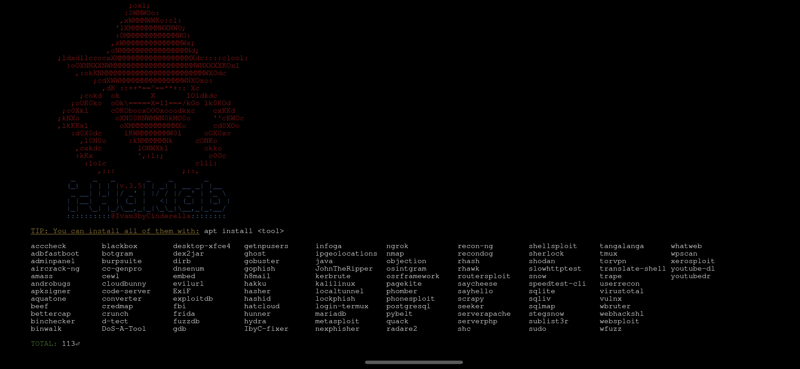

# i-Haklab v.3 2022 by @Ivam3
##### DISCLAIMER
> The main objective of the creation of this laboratory is to transport the applications, tools and/or frameworks of a Linux computer environment to the palm of the user's hand thanks to the portability that the Android operating system can provide us. We hope that this project will help contribute to the cybersecurity community and that people can develop efficient countermeasures. The use of i-Haklab without prior mutual consistency may lead to illegal activity. It is the end user's responsibility to obey all applicable local, state, and federal laws. The authors take no responsibility and are not responsible for any misuse or damage caused by this program

##### To get help join to our support groups over [Telegram group](https://t.me/iHaklab) or over our IRC group running in [i-Haklab]() the command :
```bash
i-Haklab weechat
```

### What is Termux?
> [Termux](https://github.com/termux/termux-app) is a terminal emulator application that shares the same environment of the Android operating system by starting the command line of the program `shell` using the system call `execve` and redirecting the input, output and standard error flows to the screen. [Termux](https://github.com/termux/termux-app) has a vast number of packages under the `apt` manager compiled with Android NDK and patched for compatibility, generally available on GNU/Linux systems.


### What is i-Haklab?
> [i-Haklab]() is a hacking laboratory for [Termux](https://github.com/termux/termux-app) that contains [open source tools](https://github.com/ivam3/termux-packages) for osint, pentesting, scan/find vulnerabilities, explotation and post-explotation recommended for me [Ivam3](https://wlo.link/@Ivam3) with automation commands, a many guides, books and tutorials to learn how to use tools. [i-Haklab]() use oh my fish insteractive shell to provide core infrastructure to allow you to install packages which extend or modify the look of your termux. To get help about shell and its use going to [OMF official site](https://fishshell.com/docs/current/tutorial.html).


### INSTALLATION.
- CLONING THIS REPOSITORY:
```bash
git clone https://github.com/ivam3/i-Haklab
cd i-Haklab
chmod +x setup
bash setup
```
- ADDING AT APT SOURCES LIST
```bash
apt install wget
mkdir -p $PREFIX/etc/apt/sources.list.d
wget https://raw.githubusercontent.com/ivam3/termux-packages/gh-pages/ivam3-termux-packages.list -O $PREFIX/etc/apt/sources.list.d/ivam3-termux-packages.list
apt update
apt upgrade
```


### i-Haklab will ...
- Provides a diferent types of prompt with command:
```bash
omf theme
```
- Provides a login session by password(default=Ivam3byCinderella) or fingerprint(depends features device). It could set running:
```bash
i-Haklab passwd set
```
Or change it running:
```bash
i-Haklab passwd new
```
- Provide you with a web site server running over your device with [Termux](https://github.com/termux/termux-app), wich will you can share several files over all internet. Enable it running:
```bash
i-Haklab share
```
- Provide you with deliberately vulnerable web site servers as [bWAPP](http://www.itsecgames.com/), [DVWA](https://dvwa.co.uk/) and [MUTILLIDAE](https://github.com/webpwnized/mutillidae) to practice your hacking skills searching, finding and exploting the most common vulnerabilities. Enable those running:
```bash
i-Haklab server4test
```
- Provide you more than [100 tools/frameworks](https://github.com/ivam3/termux-packages) with an easy install/remove over command `apt`. You can get the list of all availables running :
```bash
i-Haklab show alltools
```

##### If you want to suggest some tool, do it in the section of suggestions of our [Telegram BOT](https://t.me/Ivam3_Bot).


### COMMANDS
> There are several commands in [i-Haklab]() that facilitate the use of [Termux](https://github.com/termux/termux-app):

- [i-Haklab](): it is the main command that helps with automations of various processes such as visualization of user guides for the tools, download of hacking books, access to the community tutorials, payload creation automation, metaploit handler activation, brute force attacks among others. See all features running:
```bash
i-Haklab help
```
- Returns the private ip of your local network:
```bash
LOCALHOST
```
- Run OSINT setoolkit:
```bash
osrframework
```
- Enable tor connection by proxychains4:
```bash
torvpn
```
- Privide you with a root enviroment as root user(on rooted device) or fake root user(on NOT rooted device):
```bash
sudo root
````
- Or just run any command(s) with:
```bash
sudo <some command>
```
- Enable the php server:
```bash
serverphp
```
- Enable the apache server:
```bash
serverapache start/stop/restart
```
- Enables postgresql database:
```bash
postgresql start/stop/restart
```
- Init a shell to traslate any text:
```bash
traductor
```
- We know that each Android is different and this can generate various errors in the installation processes of ruby gems, python modules, among others. Automates the solving processes running:
```bash
fixer
```
- Block the termux screen and it will only be unlocked with said password or your fingerprint. It is worth mentioning that these access codes are encrypted for your security.
```bash
lock
```


### DESKTOP ENVIROMENT
> [i-Haklab]() automates the installation and configuration of a graphical environment with the xfce4 windows manager, which opens up the possibility of running tools such as wireshark and burpsuite. For this, the installation of the [Termux:Wayland](https://github.com/termux/termux-x11) application is required. Once installed it to run this enviroment just execute:
```bash
apt install termux-desktop-xfce
i-Haklab Xwayland
```


### IRC CHAT Ivam3byCinderella
> IRC (Internet Relay Chat) is an application layer protocol that facilitates communication in the form of text. The chat process works on a client/server networking model. Under the command <i-Haklab> we will find the <weechat> argument, with which you can join the official IRC Ivam3byCinderella where u can contact another i-Haklab.


### BOOKS AVAILABLES

##### If you want to suggest some book do it in the section of suggestions of our [Telegram BOT](https://t.me/Ivam3_Bot).


### UPDATE AT NEWEST VERSION 
> [i-Haklab]() is constantly updating tools and improvements. To stay updated you just have to run:
```bash
apt update i-haklab
```


##### Join to our community [Ivam3byCinderella](https://wlo.link/@Ivam3) and check all stuffs we have for you.
