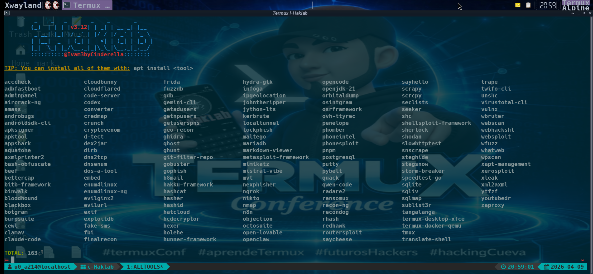

<div align="center">

</div>


<div align="center">
<a href="https://git.io/typing-svg"></a>
</div>

[](./assets/iH.gif)


> [!NOTE]
>  The main objective of the creation of this laboratory is to transport the applications, tools and/or frameworks of a Linux computer environment to the palm of the user's hand thanks to the portability that the Android operating system can provide us. We hope that this project will help contribute to the cybersecurity community and that people can develop efficient countermeasures. The use of i-Haklab without prior mutual consistency may lead to illegal activity. It is the end user's responsibility to obey all applicable local, state, and federal laws. The authors take no responsibility and are not responsible for any misuse or damage caused by this program

<div align="center">

[](https://git.io/typing-svg) 

</div>

<div align="center">
  <a href="https://www.youtube.com/c/Ivam3byCinderella" target="_blank">
    
  </a>
  <a href="http://github.com/ivam3" target="_blank">
    
  </a>
  <a href="https://whatsapp.com/channel/0029VaM2Qbd9MF8wiloJx510" target="_blank">
    
  </a>
  <a href="https://t.me/Ivam3bCinderella" target="_blank">
    
  </a>
</div>


##### To get help join to our support groups over [Telegram group](https://t.me/Ivam3by_Cinderella) or over our IRC group running in [i-Haklab]() the command :
```bash
i-Haklab weechat
```

### 🤔 What is Termux?
> [Termux](https://github.com/termux/termux-app) is a terminal emulator application that shares the same environment of the Android operating system by starting the command line of the program `shell` using the system call `execve` and redirecting the input, output and standard error flows to the screen. [Termux](https://github.com/termux/termux-app) has a vast number of packages under the `apt` manager compiled with Android NDK and patched for compatibility, generally available on GNU/Linux systems.


### 🤔 What is i-Haklab?
> [i-Haklab]() is a hacking laboratory for [Termux](https://github.com/termux/termux-app) that contains [open source tools](https://github.com/ivam3/termux-packages) for osint, pentesting, scan/find vulnerabilities, exploitation and post-exploitation recommended for me [Ivam3](https://wlo.link/@Ivam3) with automation commands, a many guides, books and tutorials to learn how to use tools. [i-Haklab]() use oh my fish insteractive shell as default (users can change it for zsh or bash) to provide core infrastructure to allow you to install packages which extend or modify the look of your termux. To get help about shell and its use going to [OMF official site](https://fishshell.com/docs/current/tutorial.html).


### 📦 INSTALLATION.
- OPTION 1 (RECOMMEND): ADDING AT APT SOURCES LIST
```bash
yes|apt install wget gnupg && \
mkdir -p $PREFIX/etc/apt/sources.list.d && \
wget https://raw.githubusercontent.com/ivam3/termux-packages/gh-pages/ivam3-termux-packages.list -O \
$PREFIX/etc/apt/sources.list.d/ivam3-termux-packages.list && \
curl -fsSL "https://raw.githubusercontent.com/ivam3/termux-packages/gh-pages/dists/stable/public_key.gpg" \
|gpg --dearmor|tee "$PREFIX/etc/apt/trusted.gpg.d/ivam3.gpg" >/dev/null && \
apt update && apt install i-haklab
```

- OPTION 2: CLONING THIS REPOSITORY: 
```bash
git clone https://github.com/ivam3/i-Haklab \
cd i-Haklab \
chmod +x setup \
bash setup
```

- OPTION 3: INSTALLING A RELEASE VERSION:
    1. Go to [releases section](https://github.com/ivam3/i-Haklab/releases)
    2. Download the .deb file of your choice
    3. Install it with:
    ```
    apt install ./path/at/i-haklab_example_all.deb
    ```

### 🧠 i-Haklab will ...
- Show information about any tool or framework:
```bash
i-Haklab about <name_of_tool>
```
- Provide different types of prompt for shell fish with command:
```bash
omf theme
```
- Switch shell between bash, zsh and fish(default):
```bash
i-Haklab setshell
```
- Run linux distributions in proot environment (CLi or Graphical):
```bash
i-Haklab pd <distro> [X11]
```
- Provide a login session by password (default: Ivam3byCinderella) or fingerprint:
```bash
i-Haklab passwd set
```
- Let you change the banner and username:
```bash
i-Haklab setbanner
i-Haklab setuser
```
- Let you update Termux system package by package:
```bash
i-Haklab aptup
```
- Provide network speed test and public IP:
```bash
i-Haklab speedtest
i-Haklab mypip
```
- Extract masive information from Android devices via ADB:
```bash
i-Haklab androforensic <option> <target>
```
- Create a Termux backup and/or restore it:
```bash
i-Haklab backup create|restore
```
- Automate brute force attacks (FTP, Mail, SSH, Telnet):
```bash
i-Haklab bruteforce
```
- Let you interact with ChatGPT-3 via CLI:
```bash
i-Haklab chatGPT
```
- Add your API keys for various services:
```bash
i-Haklab setapikey
```
- Encode/decode secret messages into ASCII files:
```bash
i-Haklab ESmsg
```
- Convert ova files and run QEMU virtual machines (no root):
```bash
i-Haklab qemufy
```
- Provide port forwarding tunnels (localtunnel, localhost.run, cloudflared):
```bash
i-Haklab tunnel
```
- Provides a server for storage and sharing of multimedia files:
```
i-Haklab 4share <server_name>
```
- Automate Metasploit processes (Payloads, Handlers, Shodan, Dirscan):
```bash
i-Haklab msf
i-Haklab handler <file.rc>
```
- Get information about BINs (CC, DC):
```bash
i-Haklab binchecker
```
- Provide telephone number information:
```bash
i-Haklab phonescan <number>
```
- Hide a Reverse Shell within a Video File:
```bash
i-Haklab payvid
```
- Test USB devices via OTG:
```bash
i-Haklab usbtest
```
- Provide vulnerable servers for testing (bWAPP, DVWA, MUTILLIDAE):
```bash
i-Haklab servers4test
```

- Bring you several automations to setup tools installed with apt, npm, pip, gem, etc. For example once execute 'apt install neovim', i-Haklab will setup it with predictable text editor settings, github copilot and AI assistant (gemini, qwen-code, opencode, ollama, mistralAI and more) to vibecode experience over Termux.

[](./assets/ia_nvim.gif)
- ver video 👆🏼

- Provide more than [100 tools/frameworks](https://github.com/ivam3/termux-packages) with an easy install/remove. List them with:
```bash
i-Haklab show alltools
i-Haklab show instatools
```


- Provides free support material for learning the [included tools](https://github.com/ivam3/termux-packages) and use of the shell in Termux.
```
i-Haklab show books
i-Haklab show tutorials
i-Haklab show QG
```
### 📕 BOOKS AVAILABLES


### 📕 TUTORIALS AVAILABLES


### 🪄 COMMANDS
> There are several commands in [i-Haklab]() that facilitate the use of [Termux](https://github.com/termux/termux-app):

- [i-Haklab](): main command for automations. See all features with:

 <details>
<summary>**List of Direct Commands** ↩️   </summary>

- **apt**: Install/remove and **configure** packages.
- **npm**: Install/remove and **configure** nodejs packages.
- **adminfiles**: Manage storage with graphical interface.
- **bat**: Enhanced 'cat' with syntax highlighting.
- **cmd**: Manage Android settings.
- **df / du**: Disk and directory usage information.
- **fixer**: Automate fixing Termux issues.
- **fzf**: Fuzzy finder.
- **gitbrowsering**: Search GitHub repositories.
- **LOCALHOST / mypip**: LAN and Public IP information.
- **lock**: Secure Termux screen.
- **openvpn**: Open OpenVPN Android application.
- **omf**: Change Oh-my-fish theme.
- **phantom-ps**: Manage phantom process limits for fix 'E:signal 9'.
- **pm**: Android package manager.
- **postgresql**: Manage PostgreSQL database.
- **proxy**: Connection via proxychains4/Tor.
- **rmcache**: Clean temporary files and cache.
- **serverapache / serverphp**: Web servers.
- **sudo**: Fake root or real root environment.
- **telegram**: Open Telegram Android application.
- **traductor**: Command line translator.
- **yazi**: Terminal file manager.
</details>


### 🎴 DESKTOP ENVIROMENT
> [i-Haklab]() automates the installation and configuration of a graphical environment with the xfce4 windows manager. Requires [Termux:Wayland](https://github.com/termux/termux-x11).
```bash
apt install termux-desktop-xfce \
i-Haklab Xwayland
```


### 📖 IRC CHAT Ivam3byCinderella
> Join the official IRC chat to contact others i-Haklab users:
```bash
i-Haklab weechat
```


### 🔥 UPDATE AT NEWEST VERSION 
> [i-Haklab]() is constantly updating tools and improvements. To stay updated you just have to run:
```bash
apt update i-haklab
```


##### Join to our community [Ivam3byCinderella](https://ivam3.github.io/#/redes) and check all stuffs we have for you.
